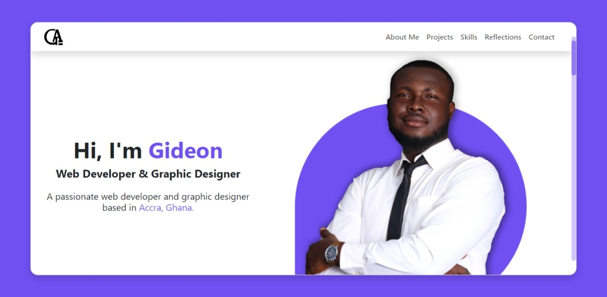

# Portfolio Website in React JS

## Introduction

This is the last day of the Codevixens Frontend Development Challenge (Day 10). I'm thrilled to showcase the projects I've built during the exhilarating 10 Days Of Frontend Challenge. This journey has been a whirlwind of learning, growth, and creative exploration, and I'm excited to share my experience with you.

## Projects

Here's a glimpse into the projects I've crafted during the challenge:

**Day 1:**

|  |  |
|---|---|
| 
  **Age Calculator** <br>
  A simple yet functional age calculator using React JS. Aim of this project was to focus on mastering state management and event handling. <br>
  **Tech Stack:**         <br>
  **Live Demo:** [https://age-calculator-pi-green-34.vercel.app/](https://age-calculator-pi-green-34.vercel.app/) <br>
  **GitHub Repository:** [https://github.com/gideonagyage/age-calculator](https://github.com/gideonagyage/age-calculator) 

**Day 2:**

|  |  |
|---|---|
|  | 
  **Dynamic Form** <br>
  A dynamic form using React JS, focusing on handling user input, validation, and state management. <br>
  **Tech Stack:**      <br>
  **Live Demo:** [https://dynamic-form-topaz.vercel.app/](https://dynamic-form-topaz.vercel.app/) <br>
  **GitHub Repository:** [https://github.com/gideonagyage/Dynamic-Form](https://github.com/gideonagyage/Dynamic-Form) 

**Day 3:**

|  |  |
|---|---|
|  | 
  **Medium Landing Page** <br>
  Replica of the Medium landing page, built using React. Showcases the use of components, styling, and responsive design principles. <br>
  **Tech Stack:**      <br>
  **Live Demo:** [https://medium-landing-page-six.vercel.app/](https://medium-landing-page-six.vercel.app/) <br>
  **GitHub Repository:** [https://github.com/gideonagyage/Medium-Landing-Page](https://github.com/gideonagyage/Medium-Landing-Page) 

**Day 4:**

|  |  |
|---|---|
|  | 
  **Quote Generator** <br>
  A simple quote generator built using React, demonstrating how to fetch data from an API (API Ninjas). <br>
  **Tech Stack:**       <br>
  **Live Demo:** [https://quote-generator-three-peach.vercel.app/](https://quote-generator-three-peach.vercel.app/) <br>
  **GitHub Repository:** [https://github.com/gideonagyage/Quote-Generator](https://github.com/gideonagyage/Quote-Generator) 

**Day 5:**

|  |  |
|---|---|
|  | 
  **Spotify Landing Page** <br>
  Recreation of the Spotify landing page, by applying CSS styles, and implementing responsive design principles. <br>
  **Tech Stack:**       <br>
  **Live Demo:** [https://spotify-landing-page-gold.vercel.app/](https://spotify-landing-page-gold.vercel.app/) <br>
  **GitHub Repository:** [https://github.com/gideonagyage/Spotify-Landing-Page](https://github.com/gideonagyage/Spotify-Landing-Page) 

**Day 6:**

|  |  |
|---|---|
|  | 
  **Weather App** <br>
  A user-friendly weather app built using React, which demonstrates the integration of a weather API. <br>
  **Tech Stack:**       <br>
  **Live Demo:** [https://weather-app-seven-murex-31.vercel.app/](https://weather-app-seven-murex-31.vercel.app/) <br>
  **GitHub Repository:** [https://github.com/gideonagyage/Weather-App](https://github.com/gideonagyage/Weather-App) 

**Day 7:**

|  |  |
|---|---|
|  | 
  **To-Do List App** <br>
  A simple yet functional to-do list app that allows users to add, complete, edit, and delete tasks. <br>
  **Tech Stack:**       <br>
  **Live Demo:** [https://to-do-list-app-coral-pi.vercel.app/](https://to-do-list-app-coral-pi.vercel.app/) <br>
  **GitHub Repository:** [https://github.com/gideonagyage/To-Do-List-App](https://github.com/gideonagyage/To-Do-List-App) 

**Day 8:**

|  |  |
|---|---|
|  | 
  **Stopwatch App** <br>
  A stopwatch application with with buttons for start, stop, and reset. Very functional and user-friendly. <br>
  **Tech Stack:**      <br>
  **Live Demo:** [https://stopwatch-app-phi.vercel.app/](https://stopwatch-app-phi.vercel.app/) <br>
  **GitHub Repository:** [https://github.com/gideonagyage/Stopwatch-App](https://github.com/gideonagyage/Stopwatch-App) 

**Day 9:**

|  |  |
|---|---|
|  | 
  **Photo Gallery** <br>
  A Gallery of Photos using an external API (Unspalsh), with popular key words and a search functionality. <br>
  **Tech Stack:**       <br>
  **Live Demo:** [https://photo-gallery-navy-five.vercel.app/](https://photo-gallery-navy-five.vercel.app/) <br>
  **GitHub Repository:** [https://github.com/gideonagyage/Photo-Gallery](https://github.com/gideonagyage/Photo-Gallery) 

**Day 10:**

This is Day 10 of the challenge, which happens to be the last day. Below are the details of the project:

## Installation

1. Clone the repository:

```bash
git clone https://github.com/gideonagyage/Portfolio-Website.git
```

2. Navigate to the project directory:

```bash
cd Portfolio-Website
```

3. Install dependencies:

```bash
npm install
```

## Usage

1. Start the development server:

```bash
npm start
```

2. Open your browser and navigate to

```bash
http://localhost:3000.
```

## Skills

This challenge has helped me hone and expand my skills in:

1. **HTML & CSS**: Responsive design, CSS media queries, flexbox, grid, and more.
2. **JavaScript**: DOM manipulation, event handling, site navigation, and more.
3. **React**: Component-based architecture, state management, and more.
4. **API Integration**: Fetching data from external APIs and handling the responses.
5. **Version Control (Git)**: Branching, merging, and committing.

## Screenshots

- Desktop View



- Desktop View 2


- Mobile View


## Live Demo

Check out the live demo [here](https://portfolio-website-blond-five.vercel.app/).

## Experience & Reflections

The `10DaysOfFrontend` challenge has been an incredible learning experience. I've pushed my boundaries, explored new technologies, and discovered the joy of building creative projects. I'm incredibly grateful for the opportunity to have participated in this challenge and for the valuable skills I've gained.

## Conclusion

This portfolio is a testament to my dedication and passion for frontend development. I'm excited to continue learning and growing as a developer, and I'm eager to take on new challenges and create innovative projects.

**Thank you for visiting my portfolio!**

## Contact

[Send an Email](mailto:gideonagyage@gmail.com)

## License

This project is licensed under the MIT License.

## Acknowledgements

- [Codevixens](https://codevixens.org/) for organizing the challenge.
- Chinaza Igboanugo, Lois Bassey, and Oyinkansola Shoroye for their contributions and guidance.

Let's connect and build something amazing together!
